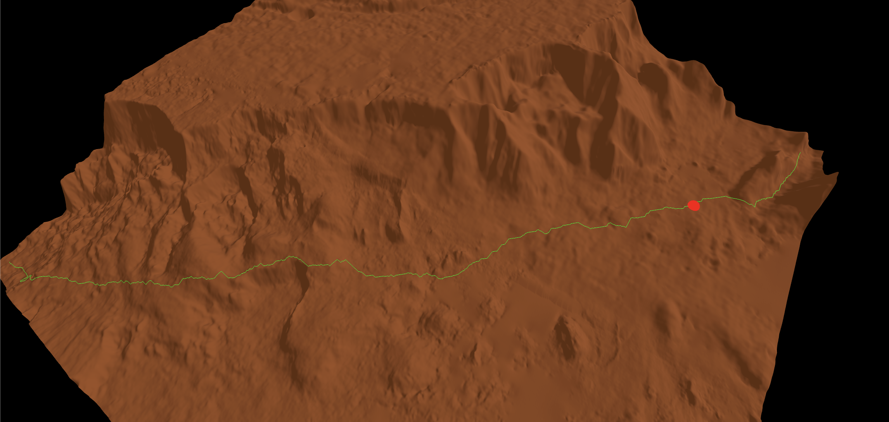

# NASA JPL Capstone 2024/2025

<div align="center" >
  
  <br/>
Mars Elevation Model Pathfinding Algorithm (MEMPA)
  <br/>
  <a href="https://github.com/lucakhodge/nasa-jpl-capstone-2024-2025/tree/main/mempa">Source Code</a> | <a href="https://github.com/lucakhodge/nasa-jpl-capstone-2024-2025/tree/main/docs">Documentation</a>
  <br/>
  <br/>
</div>

## Team Members

- Adam Carlson, Brock Hoos, Grace Harrel, Kevin Buhler, Luca Hodge, Oscar Mikus, Ryan Wagster
- David Blaines (TA),  Marcel Llopis (Sponsor)

## Dependencies

- Windows Subsystem for Linux (WSL)
- GDAL: ```sudo apt install libgdal-dev```
- JSON Support: ```sudo apt-get install nlohmann-json3-dev```
- tiff file: https://astrogeology.usgs.gov/search/map/mars_mgs_mola_mex_hrsc_blended_dem_global_200m | https://planetarymaps.usgs.gov/mosaic/Mars_MGS_MOLA_DEM_mosaic_global_463m.tif

## GUI



## Folder Structure
```
.
├── C++.gitignore
├── README.md
├── assets
│   ├── NASAJPL_Logo.png
│   └── mars_path.png
├── docs
│   ├── html
│   └── latex
├── mempa
│   ├── algorithm
│   │   ├── Doxyfile
│   │   ├── Makefile
│   │   ├── README.md
│   │   ├── build
│   │   ├── src
│   │   │   ├── dem-handler
│   │   │   │   ├── DemHandler.cpp
│   │   │   │   ├── DemHandler.hpp
│   │   │   │   └── DemHandler.inl
│   │   │   ├── logger
│   │   │   │   ├── JsonPathLogger.cpp
│   │   │   │   ├── JsonPathLogger.hpp
│   │   │   │   ├── PathLogger.cpp
│   │   │   │   ├── PathLogger.hpp
│   │   │   │   ├── TextPathLogger.cpp
│   │   │   │   └── TextPathLogger.hpp
│   │   │   ├── main
│   │   │   │   ├── CLI.cpp
│   │   │   │   ├── CLI.hpp
│   │   │   │   ├── CLI.inl
│   │   │   │   └── main.cpp
│   │   │   ├── metrics
│   │   │   │   ├── Analyitics.cpp
│   │   │   │   ├── Metrics.cpp
│   │   │   │   ├── Metrics.hpp
│   │   │   │   ├── TerrainMetrics.cpp
│   │   │   │   └── TerrainMetrics.hpp
│   │   │   ├── rover-pathfinding-module
│   │   │   │   ├── SearchAlgorithm.cpp
│   │   │   │   ├── SearchAlgorithm.hpp
│   │   │   │   ├── dijkstras.cpp
│   │   │   │   └── dijkstras.hpp
│   │   │   └── rover-simulator
│   │   │       ├── RoverSimulator.cpp
│   │   │       ├── RoverSimulator.hpp
│   │   │       └── RoverSimulator.inl
│   │   └── tests
│   │       ├── DemTester.cpp
│   │       ├── DijkstrasTester.cpp
│   │       ├── mine
│   │       ├── run_tests.sh
│   │       └── test_coordinates.json
```